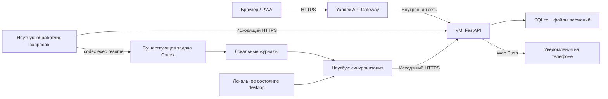

# Архитектура и схема работы

Приложение состоит из веб-сервиса на VM и двух локальных служб на ноутбуке.
Codex выполняет запросы на ноутбуке. Облако хранит доступную пользователям
переписку, вложения и очередь, проверяет права и отправляет уведомления.
Telegram используется только для входа; Telegram-бот не передаёт сообщения.

## Компоненты

Стрелки HTTPS от ноутбука обозначают инициатора соединений. Через эти запросы
обработчик получает очередь и публикует результаты; сервер не подключается к
ноутбуку. Для работы приложения не нужны входящие порты на ноутбуке,
управляющая задача, автоматизация Codex или второй App Server.

| Часть | Реализация и ответственность |
| --- | --- |
| Интерфейс | `web/`: React/TypeScript, PWA, проекты, задачи, общая история, вложения, одобрения, квота |
| HTTP API | `server/app.py`, `server/api.py`: FastAPI, сессии, API браузера и сборщика |
| Правила приложения | `cloud/`: доступ, политика одобрений, каталог, запросы, ответы и квота; название каталога не означает использование Cloud Functions |
| Хранилище VM | SQLite с миграциями в `server/migrations.py`; вложения — отдельно на диске. Домены доступа, каталога и запросов нормализованы; часть служебных метаданных остаётся JSON |
| Выполнение | `cli_worker.py`, `local_queue.py`, `worker_dispatch.py`, `cli_session.py`, `worker_execution.py`, `worker_recovery.py`: локальная очередь, проверка прав и настроек, CLI, восстановление и публикация |
| Синхронизация | `history_watch.py`, `desktop_catalog.py`, `history_sync.py`, `rollout_history.py`: каталог, публичная история, активность и квота |
| Уведомления | `server/push.py`, `server/push_preview.py`, `web/public/sw.js`: подписки, проверка доступа, устранение повторов и отображение push |

## Путь запроса

1. Пользователь входит через Telegram Login. Сервер проверяет подписанный ответ
   и выдаёт свою веб-сессию. Дальше сайт работает с API приложения.
2. Пользователь выбирает задачу и отправляет текст с необязательными вложениями.
   Сервер проверяет доступ; вложения загружаются частями и проверяются по SHA-256.
3. Запрос владельца допускается сразу. Для участника применяется выбранная
   владельцем политика: с одобрением или без него. Одобрение фиксирует конкретные
   текст, задачу и хеши вложений.
4. Локальная служба `net.warcraft.codex-requests` опрашивает сервер исходящими
   HTTPS-запросами. Перед новым запуском повторно проверяются действительность
   запроса, текущие права и ограничения задачи.
5. Сборщик проверяет исходные модель, режим рассуждения, рабочую папку и права
   выбранной задачи. Если настройки отсутствуют или несовместимы, он не угадывает
   замену. Если writer lock занят desktop, запрос ждёт освобождения задачи.
6. Установленный CLI выполняет `codex exec resume` для существующего ID задачи.
   Это продолжение той же задачи, а не новый Codex на VM. CLI-вызов не получает
   desktop-инструменты `codex_app`; обычное desktop-приложение сохраняет свой режим.
7. Результат сопоставляется с конкретным новым ходом и запросом. Обработчик
   публикует состояние и ответ на VM, откуда их получает интерфейс.
8. Сервер отправляет push после повторной проверки доступа получателя. Уведомление
   содержит название задачи и до 500 символов запроса или ответа. Переход из push
   требует действующей сессии и текущего доступа.

## Независимая синхронизация

`net.warcraft.codex-history` работает отдельно от выполнения запросов, поэтому
долгий CLI-запуск не останавливает обновление истории. Обе службы управляются
`launchd`; интервал между проходами по умолчанию — 10 секунд, сами проходы могут
занимать дольше. Браузер также периодически получает обновления API.

Каталог использует точные привязки задач к проектам из локального состояния
приложения и именованные неархивные задачи из локальной SQLite. Привязки не
выводятся из похожих названий или рабочих путей. Проектные задачи без локально
поддерживаемого источника не включаются автоматически. Архивные, безымянные
черновики, внутренние подзадачи и задачи вне проектов не входят в этот каталог.
Это адаптер к внутреннему формату desktop, а не стабильный публичный API.
Неизвестная схема или ошибка чтения сохраняет последний успешный снимок.

Версионированный читатель журналов передаёт видимые сообщения пользователя и
ассистента. Внутренние рассуждения, системные инструкции и вывод инструментов
не экспортируются как общая история. Контрольные позиции чтения позволяют
догружать растущие журналы; узнаваемые секреты в публичном тексте редактируются.

Активность определяется по началу/завершению хода и удерживаемой writer lock.
Это наблюдаемая активность хода, а не статус общей цели. При отсутствии
достаточных данных публикуется `unknown`. Недельная квота берётся из записей
журнала и показывается вместе со временем наблюдения и сброса — это последнее
полученное значение, а не постоянное прямое соединение с API лимитов.

## Доступ, сбои и эксплуатация

Владелец видит все синхронизированные проекты. Участник получает доступ к проекту
или отдельным задачам; явный запрет задачи сильнее проектного разрешения. Новые
задачи наследуют проектный доступ. В пределах разрешённой задачи история общая.
Правила проверяются при чтении, отправке, работе с вложениями и уведомлениях.

Серверная и локальная очереди сохраняют состояния и намерение запуска. Таймаут
или неопределённый результат не являются разрешением повторить запрос. Ответ
восстанавливается по точному ходу; неоднозначность сохраняется для разбирательства.
Идентичность хода также устраняет повторные уведомления из истории и API ответов.
Неопределённая отправка push не повторяется автоматически; явно временные ошибки
провайдера повторяются с ограниченной задержкой и числом попыток.

Ноутбук должен быть включён, иметь сеть и авторизованный CLI для исполнения и
синхронизации. При его недоступности VM продолжает отдавать сайт и уже сохранённую
историю, но новые запросы ждут обработки с учётом сроков действия. История и
вложения действительно хранятся на VM; веб-сервис не является лишь прозрачным
туннелем к ноутбуку.

Развёртывание выполняется отдельно по SSH/SCP: проверка хеша архива, репетиция
миграции и восстановления, переключение релиза и проверка сервиса. По явному
разрешению владельца можно привязать SSH к существующему интерфейсу через
`--ssh-interface`; это не меняет VPN и системные маршруты. Для обычной работы
сайта этот административный SSH-канал не используется.

Подробности: [эксплуатация](deployment.md), [границы доверия](security.md),
[аудит и решение владельца о приёмке](refactoring-audit.md).
