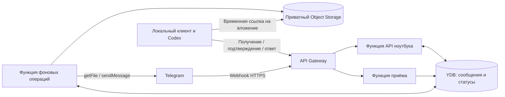

# Облачная схема Telegram ↔ Codex

Статус: проект, не развёрнуто. Проверены документы сервисов 2026-09-20.
Рабочий код в корне — локальный текстовый прототип, не облачная реализация.

## Решение

Приём сообщений, хранение вложений и отправка ответов находятся в Yandex Cloud.
Анализ остаётся в существующей локальной задаче Codex. Ноутбук делает исходящие
HTTPS-запросы к API приложения; облако не подключается к ноутбуку. Не нужны
входящие порты, туннель, публичный SSH, доступ к внутреннему сокету Codex или
перенос учётной записи Codex в функцию. Когда ноутбук выключен, сообщения
сохраняются, но анализ не выполняется.

Это разрешённое приложение для обмена тестовыми данными, а не универсальный
прокси к Telegram. Доступность облачного домена не заменяет разрешение СИБ.
До эксплуатации согласовать назначение, состав данных и направления трафика.

Стрелки от ноутбука показывают инициатора соединения; ответ по тому же HTTPS
возвращает данные клиенту.

## Компоненты

- API Gateway: отдельные маршруты для Telegram и клиента, версия API v1.
- Cloud Functions: ingress, клиентский API и worker. Обработчики короткие;
  запрос не ждёт окончания работы Codex. Нет фоновой работы после возврата HTTP.
- YDB Serverless: записи сообщений, доставки, привязок пользователей и ответов.
  Выдача сообщений и фиксация состояний выполняются транзакционно.
- Lockbox: токен Telegram и секрет вебхука. Функции получают секреты через
  сервисный аккаунт с минимальными правами. Секреты не включаются в Git,
  артефакты сборки, Terraform variables/state или логи запросов.
- Object Storage: приватные вложения. Для текстового MVP не создаётся.
- Timer trigger: подбирает отложенные операции worker. Вызовы могут повторяться;
  worker атомарно захватывает задания с ограниченным сроком владения.

YDB выбрана потому, что состояние и защита от повторной обработки всё равно
нужны. Message Queue можно добавить при росте нагрузки. Гарантии очереди сами
по себе не обеспечивают однократную отправку Telegram sendMessage.

## Приём и доставка

1. Telegram отправляет update на POST /v1/telegram/webhook. Проверяется
   X-Telegram-Bot-Api-Secret-Token, затем тип личного чата и числовой sender ID.
   Username годится только для первоначальной привязки по заранее заданному
   владельцем списку; после неё доступ закрепляется за числовым ID.
2. В транзакции сохраняется запись с уникальным ключом (bot_id, update_id).
   Только после сохранения возвращается 2xx. Повторный update не создаёт новую
   работу; недоступность БД возвращает ошибку, чтобы Telegram повторил запрос.
3. Для вложения сохраняется Telegram file_id и отдельное задание загрузки.
   Worker скачивает файл в приватный бакет и сохраняет размер и SHA-256.
   Входные имена не становятся путями, архивы автоматически не распаковываются.
   Ошибка скачивания не скрывает само сообщение и показывается как attachment_failed.
4. Локальный клиент вызывает POST /v1/inbox/claim. Атомарно получает пачку и
   непрозрачный delivery_token с lease на 2 минуты. Это предлагаемая настройка,
   не лимит сервиса. Истёкшая неподтверждённая выдача допускает повторную доставку.
5. Клиент сначала сохраняет сообщения в локальную SQLite, затем подтверждает
   delivery_token через POST /v1/inbox/ack. Уникальный cloud_message_id защищает
   локальную очередь от повторов. Ack означает сохранение на ноутбуке, а не
   окончание анализа. Pending-задания восстанавливаются после перезапуска.
6. Плановая проверка текущей задачи Codex читает локальную очередь. Сообщения и
   логи — внешние данные с явно указанным автором. Они не разрешают команды,
   публикацию кода или раскрытие файлов. В MVP задача готовит только фиксированное
   подтверждение; полноценные диагностические ответы — следующий этап.
7. Ответ сохраняется локально и отправляется через POST /v1/replies с
   idempotency_key. API сохраняет его до возвращения 202. Повтор с тем же ключом
   и тем же телом возвращает прежний reply_id; изменённое тело возвращает 409.
8. Worker отправляет ответ в Telegram по chat_id из исходного сообщения. Клиент
   не может указать произвольного адресата. GET /v1/replies/{id} возвращает
   queued/sending/sent/uncertain/failed и позволяет проверить результат.

Состояние sending фиксируется ДО sendMessage. Если процесс умер или ответ API
потерялся, доставка может уже состояться. Такой результат становится uncertain
и требует ручной сверки; автоматически повторять его нельзя. Известный отказ
(например, 429 с retry_after) обрабатывается отдельно. Нельзя обещать exactly-once
доставку в Telegram при неоднозначном сетевом результате.

## Доступ клиента

У ноутбука отдельный случайный отзываемый ключ только для одного mailbox.
Он хранится в .env (0600) или Keychain. В облаке хранится проверочное значение
ключа, а не полномочия администратора облака. Ключ передаётся в Authorization,
не в query string. API Gateway function-authorizer привязывает его к mailbox;
каждая операция проверяет принадлежность сообщения этому mailbox. Прямой вызов
бизнес-функций извне запрещён; вызывать их может сервисный аккаунт Gateway.

Авторизация webhook и клиентского API различается. Отдельный endpoint /health
не возвращает конфигурацию, сообщения или секреты. Пользовательские запросы
не могут задавать URL назначения, shell-команды или произвольные пути.

Вложения выдаются по короткоживущим подписанным ссылкам на конкретный объект
после авторизации в API. Поэтому для СИБ нужны два исходящих направления:
домен API приложения и используемый домен Object Storage. Ссылки не логируются;
бакет не публичный. Большие файлы не пропускаются через JSON-ответ функции.

## Ограничения и стоимость

- Первая версия: текст, два разрешённых пользователя, один mailbox и одна задача.
- Второй этап: .log/.jsonl и изображения, собственный лимит 10 МиБ на вложение.
  Telegram getFile обычного Bot API ограничивает скачивание 20 МБ; 10 МиБ —
  выбранный запас, не лимит Yandex Cloud. MIME и размер проверяются при загрузке.
- Предлагаемый срок хранения сообщений и файлов — 7 дней; срок явно проверяется
  API, а физическая очистка выполняется отдельно. Ограничить общий объём mailbox.
- Для интерактивных функций выбрать короткий timeout. В текущей документации
  Cloud Functions JSON запрос/ответ ограничен 3,5 МБ; время до 1 часа относится
  к максимальному пределу, а свыше 10 минут требует долгоживущих функций.
  Нашему HTTP API долгоживущие функции не требуются.
- Опрос раз в 5 минут — 8640 циклов за 30 дней при непрерывной работе. Число
  вызовов функций больше при авторизации, ответах и повторах; учитываются также
  операции YDB, Lockbox, хранение, логи и исходящий трафик. Бесплатность не обещать.
- Ограничить частоту, размер пачки, concurrency и RU/с; включить уведомления
  бюджета. Уведомление бюджета само по себе не является жёстким стопом расходов.
- Получение облачным клиентом ещё не равно запуску Codex. При текущем heartbeat
  анализ начинается на очередной проверке при работающем приложении; задержка
  около интервала плюс обработка, без обещания точного времени.

## Переход с локального прототипа

1. Реализовать API-контракты и тесты на синтетических updates без облака.
2. Подготовить Terraform: Gateway, YDB, функции, сервисные аккаунты, ссылки на
   Lockbox, минимальные роли; объекты и таймер worker только по этапам.
3. В разрешённом облачном каталоге проверить исходящий Telegram HTTPS и getMe,
   а с ноутбука — /health и авторизованную выдачу. Доступность документации
   Yandex Cloud не доказывает доступность развёрнутого приложения.
4. Перед переключением остановить старый getUpdates-опрос. У Telegram webhook
   и getUpdates несовместимы; не использовать drop_pending_updates=true.
5. Зарегистрировать webhook с отдельным секретом, передать токен бота в Lockbox.
   После успешной миграции убрать необходимость в Telegram-токене на ноутбуке.
6. Перевести существующую автоматизацию на облачный backend. SQLite-схему
   версионировать; не заменять локальные записи без миграции/явного решения.
7. Пройти реальный smoke test: Telegram → облако → эта задача → облако →
   Telegram. Успех фиксируется по message_id ответа, а не по очереди на отправку.
8. Добавить вложения и только после этого ответы по диагностике игры.

Отдельно проверить повтор webhook, потерю ответа claim/ack, сон ноутбука,
перезапуск клиента, истечение lease, отозванный ключ, запрещённого пользователя,
подмену mailbox, недоступность YDB, сетевой таймаут отправки и лимиты вложений.

Развёртывание требует выбранного cloud/folder, платёжного аккаунта, права
создавать ресурсы, секретов и согласованного доступа с устройства. Эти данные
в репозитории не хранятся. Доступ к Yandex Cloud и живой маршрут не проверены.

## Источники

- [Telegram webhook, secret_token и getFile](https://core.telegram.org/bots/api)
- [Функция и жизненный цикл экземпляра](https://yandex.cloud/ru/docs/functions/concepts/function)
- [Лимиты Cloud Functions](https://yandex.cloud/ru/docs/functions/concepts/limits)
- [Авторизация API Gateway через функцию](https://yandex.cloud/ru/docs/api-gateway/concepts/extensions/function-authorizer)
- [YDB Serverless](https://yandex.cloud/ru/docs/ydb/concepts/serverless-and-dedicated)
- [Lockbox в serverless](https://yandex.cloud/ru/blog/posts/2023/06/serverless-and-secrets)
- [Подписанные ссылки Object Storage](https://yandex.cloud/ru/docs/storage/operations/objects/link-for-download)
- [Timer trigger](https://yandex.cloud/ru/docs/functions/concepts/trigger/timer)
